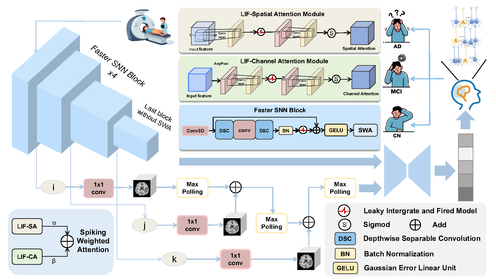
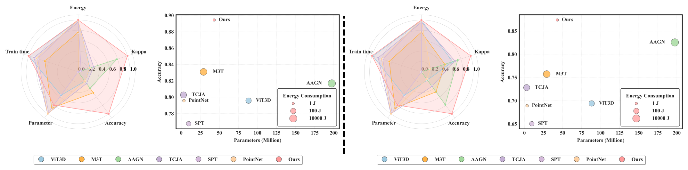
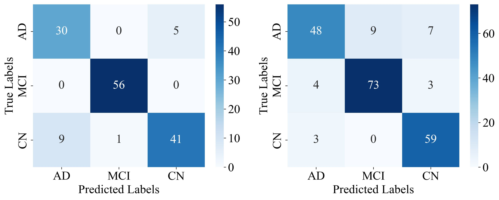

# FasterSNN: A Lightweight and Interpretable Spiking Neural Model for Alzheimer's Disease Diagnosis
**FasterSNN** is a lightweight spiking neural network for Alzheimer's disease diagnosis from 3D MRI scans. It combines bio-inspired LIF neurons with efficient region-adaptive convolutions and multi-scale attention, achieving **89.44% accuracy** on ADNI data while using **152× less energy** than traditional CNNs. The model's sparse event-driven computation and interpretable architecture make it ideal for clinical deployment.

  
*Figure: FasterSNN Architecture*
# Project Structure
```
FasterSNN/
├── README.md
├── requirement.txt
├── main.py
├── train.py
├── test.py
├── util.py
├── model.py
├── dataloader.py
├── plot.py
```
## Primary Contributions
- **Novel Hybrid Architecture**: Combines bio-inspired LIF neurons, region-adaptive convolution, and multi-scale spiking attention for efficient AD diagnosis.
- **Energy Efficiency**: Achieves state-of-the-art accuracy with only 1.15J energy consumption, making it practical for resource-limited settings.
- **Clinical Impact**: Focuses on early MCI detection (90% accuracy in AIBL dataset) using cost-effective MRI data.
- **Open Science**: Provides complete source code and pretrained models for reproducibility and community adaptation.
  
*Figure: Rodar map And Bubble map of FasterSNN on ADNI dataset*
## Proposed Method
**FasterSNN integrates three key innovations:**  
1. **LIF Neurons**: Mimic biological spiking behavior for sparse, energy-efficient computations.  
2. **Region-Adaptive Convolution**:  
   - Core regions: Standard 3D convolution for rich feature extraction.  
   - Edge regions: Depthwise separable convolution for efficiency.  
3. **Multi-Scale Fusion Pyramid**:  
   - 4-level feature pyramid with learnable cross-layer weights.  
   - SWA module dynamically balances channel/spatial attention (α=β=0.5).  

***Key Equations*:**  
- Membrane potential update: `Vₜ = λVₜ₋₁ + (1/T)∑xₜ⁽ⁱ⁾`  
- Multi-scale fusion: `F_fusion = ∑wᵢ⋅Pool(Conv₁ₓ₁(X_out))`  

## Requirements
```plaintext
Python == 3.10
torch == 2.4.1
nibabel == 5.2.1
numpy == 1.24.4
scikit-learn == 1.3.2
matplotlib == 3.7.5
seaborn == 0.13.2
tqdm == 4.67.1
```
## Training

### 1. Data Preparation  
Organize MRI data in NIfTI format with the following directory structure:
```
dataset/
├── train/
│ ├── AD/
│ ├── MCI/
│ └── CN/
└── test/
├── AD/
├── MCI/
└── CN/
```

### 2. Start Training
```bash
python train.py \
  --epochs 20 \
  --lr 1e-3 \
  --weight_decay 1e-3 \
  --device cuda:0  # GPU recommended
```
### 3. Key Configurations

| Parameter          | Value               | Description                          |
|--------------------|---------------------|--------------------------------------|
| Batch size         | 16                  | Input batch size                     |
| Input dimensions   | 64×64×64            | MRI volume resolution                |
| Time steps         | 2                   | Temporal simulation steps            |
| Learning rate      | 1e-3                | Initial learning rate                |
| LR scheduler       | ReduceLROnPlateau   | Patience=3, factor=0.5               |
| Membrane decay (λ) | 0.9                 | LIF neuron potential decay rate      |

### Evaluation
```bash
python test.py \
  --batch_size 16 \
  --device cuda:0
```
### Results
### 1. Comparative Experiments (ADNI)
| Model             | Accuracy | Precision | Recall | F1-score | Kappa  | AVG AUC | Energy (J) | Train time (s) | Parameter (M) | Time Step |
|-------------------|----------|-----------|--------|----------|--------|---------|------------|----------------|--------------|-----------|
| ResNet50      | 0.8380   | 0.8392    | 0.8380 | 0.8370   | 0.7516 | 0.9414  | 117.74     | <span style="color:blue">17</span> | 46.16        | -         |
| ResNet101     | 0.8521   | 0.8569    | 0.8521 | 0.8534   | 0.7738 | <span style="color:blue">0.9422</span> | 175.39    | 20           | 85.21      | -         |
| FCN        | <span style="color:blue">0.8732</span> | <span style="color:blue">0.8837</span> | <span style="color:blue">0.8732</span> | <span style="color:blue">0.8727</span> | <span style="color:blue">0.8050</span> | 0.9396  | 271.44    | 19           | 10.09      | -         |
| ViT3D        | 0.7958   | 0.8124    | 0.7958 | 0.7984   | 0.6870 | 0.9261  | 131.94     | <span style="color:red">15</span>   | 88.26        | -         |
| M3T         | 0.8310   | 0.8362    | 0.8310 | 0.8321   | 0.6385 | 0.8788  | 2726.73    | 73            | 29.23       | -         |
| AAGN         | 0.8169   | 0.8207    | 0.8451 | 0.8169   | 0.7630 | 0.9418  | 11412.47   | 192           | 197.51      | -         |
| VGGSNN       | 0.8169   | 0.8347    | 0.8169 | 0.8205   | 0.7963 | 0.9266  | 602.43     | <span style="color:blue">17</span> | 10.08       | 16        |
| ResSNN      | 0.7183   | 0.7352    | 0.7183 | 0.7197   | 0.5686 | 0.8678  | <span style="color:red">1.10</span> | 22           | 5.85       | <span style="color:blue">4</span>  |
| TCJA        | 0.8028   | 0.8134    | 0.8028 | 0.8059   | 0.7016 | 0.9003  | 513.65     | 34            | <span style="color:red">2.87</span>      | 16        |
| SPT         | 0.7676   | 0.7885    | 0.7676 | 0.7638   | 0.6511 | 0.9219  | 19.57      | 47            | 9.64        | <span style="color:red">2</span>  |
| PointNet     | 0.7958   | 0.7885    | 0.7958 | 0.7904   | 0.6854 | 0.9068  | 1.47       | 43            | <span style="color:blue">3.47</span>      | 16        |
| **Ours**          | <span style="color:red">0.8944</span> | <span style="color:red">0.8972</span> | <span style="color:red">0.8944</span> | <span style="color:red">0.8943</span> | <span style="color:red">0.8394</span> | <span style="color:red">0.9854</span> | <span style="color:blue">1.15</span> | <span style="color:red">15</span> | 43.11      | <span style="color:red">2</span> |

### 2. Comparative Experiments (AIBL)
| Model               | Accuracy | Precision | Recall | F1-score | Kappa  | AVG AUC | Energy (J) | Train time (s) | Parameter (M) | Time Step |
|---------------------|----------|-----------|--------|----------|--------|---------|------------|----------------|--------------|-----------|
| ResNet50      | 0.7864   | 0.7887    | 0.7864 | 0.7862   | 0.6757 | 0.9014  | 104.39     | 17             | 46.16        | -         |
| ResNet101    | 0.7621   | 0.7891    | 0.7621 | 0.7631   | 0.6423 | 0.9022  | 155.50     | 20             | 85.21        | -         |
| FCN            | <span style="color:blue">0.8350</span> | <span style="color:blue">0.8539</span> | <span style="color:blue">0.8350</span> | <span style="color:blue">0.8346</span> | <span style="color:blue">0.7470</span> | <span style="color:blue">0.9174</span> | 239.54    | 19             | 10.09       | -         |
| ViT          | 0.6942   | 0.6943    | 0.6942 | 0.6866   | 0.5326 | 0.8346  | 116.10     | <span style="color:blue">15</span>   | 88.26        | -         |
| M3T            | 0.7573   | 0.7563    | 0.7573 | 0.7548   | 0.6327 | 0.8867  | 2479.65    | 68             | 29.23        | -         |
| AAGN          | 0.8256   | 0.8266    | 0.8252 | 0.8247   | 0.7209 | 0.9151  | 10503.74   | 173            | 197.51       | -         |
| VGGSNN        | 0.7913   | 0.7916    | 0.7913 | 0.7905   | 0.7245 | 0.8970  | 545.80     | 20             | 10.08        | 16        |
| ResSNN        | 0.5874   | 0.5893    | 0.5874 | 0.5873   | 0.3546 | 0.7424  | <span style="color:red">0.97</span> | 22             | 5.85        | <span style="color:blue">4</span>  |
| TCJA           | 0.7282   | 0.7563    | 0.7282 | 0.7297   | 0.7016 | 0.8603  | 465.35     | 32             | <span style="color:red">2.87</span>      | 16        |
| SPT            | 0.6505   | 0.6557    | 0.6505 | 0.6523   | 0.4732 | 0.8083  | 17.78      | 47             | 9.64         | <span style="color:red">2</span>  |
| PointNet      | 0.6893   | 0.7024    | 0.6893 | 0.6776   | 0.5347 | 0.8307  | 1.32       | 43             | <span style="color:blue">3.47</span>      | 16        |
| **Ours**            | <span style="color:red">0.8737</span> | <span style="color:red">0.8714</span> | <span style="color:red">0.8727</span> | <span style="color:red">0.8681</span> | <span style="color:red">0.8094</span> | <span style="color:red">0.9364</span> | <span style="color:blue">1.01</span> | <span style="color:red">12</span> | 43.11      | <span style="color:red">2</span> |

 
*Figure: Confusion matrix of FasterSNN on ADNI dataset*

### 3. Ablation Study (ADNI)
| Model   | Accuracy | Precision | Recall | F1-score | Kappa  | AVG AUC | Energy (J) | Train time (s) | Parameter (M) | Time Step |
|---------|----------|-----------|--------|----------|--------|---------|------------|----------------|--------------|-----------|
| w/o LIF | <span style="color:blue">0.8662</span> | <span style="color:blue">0.8664</span> | <span style="color:blue">0.8662</span> | <span style="color:blue">0.8612</span> | <span style="color:blue">0.7931</span> | <span style="color:blue">0.9529</span> | <span style="color:blue">3.81</span> | <span style="color:blue">17</span> | <span style="color:blue">43.11</span> | <span style="color:red">1</span> |
| w/o MSF | 0.7465 | 0.7318 | 0.7362 | 0.6831 | 0.6082 | 0.8967 | <span style="color:red">1.15</span> | <span style="color:red">15</span> | <span style="color:red">43.05</span> | <span style="color:blue">2</span> |
| **Ours** | <span style="color:red">0.8944</span> | <span style="color:red">0.8972</span> | <span style="color:red">0.8944</span> | <span style="color:red">0.8943</span> | <span style="color:red">0.8394</span> | <span style="color:red">0.9854</span> | <span style="color:red">1.15</span> | <span style="color:red">15</span> | <span style="color:blue">43.11</span> | <span style="color:blue">2</span> |
### 4. Ablation Study (AIBLI)
| Model   | Accuracy | Precision | Recall | F1-score | Kappa  | AVG AUC | Energy (J) | Train time (s) | Parameter (M) | Time Step |
|---------|----------|-----------|--------|----------|--------|---------|------------|----------------|--------------|-----------|
| w/o LIF | <span style="color:blue">0.8495</span> | <span style="color:blue">0.8485</span> | <span style="color:blue">0.8495</span> | <span style="color:blue">0.8480</span> | <span style="color:blue">0.7802</span> | <span style="color:blue">0.9395</span> | <span style="color:blue">3.34</span> | <span style="color:blue">17</span> | <span style="color:blue">43.11</span> | <span style="color:red">1</span> |
| w/o MSF | 0.8398 | 0.8410 | 0.8398 | 0.8381 | 0.7587 | 0.9148 | <span style="color:red">1.01</span> | <span style="color:red">15</span> | <span style="color:red">43.05</span> | <span style="color:blue">2</span> |
| **Ours** | <span style="color:red">0.8737</span> | <span style="color:red">0.8714</span> | <span style="color:red">0.8727</span> | <span style="color:red">0.8681</span> | <span style="color:red">0.8094</span> | <span style="color:red">0.9364</span> | <span style="color:red">1.01</span> | <span style="color:red">12</span> | <span style="color:blue">43.11</span> | <span style="color:red">2</span> |

### Citation